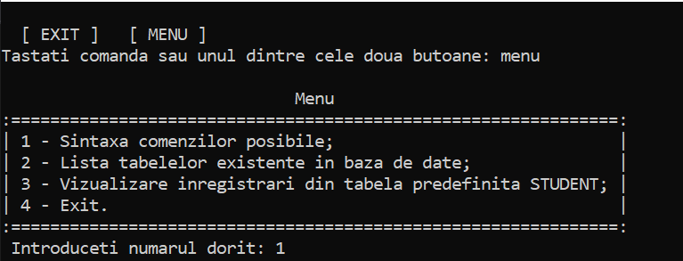
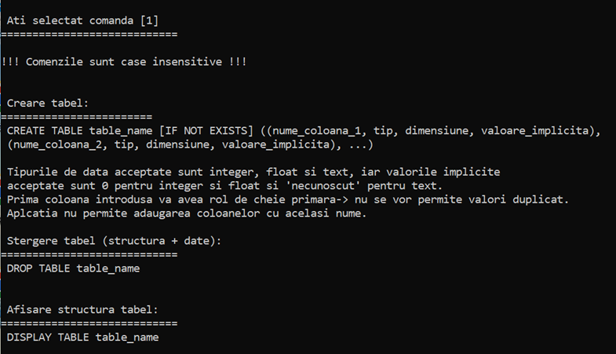
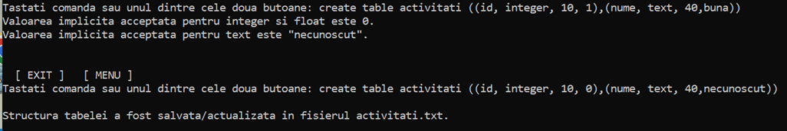
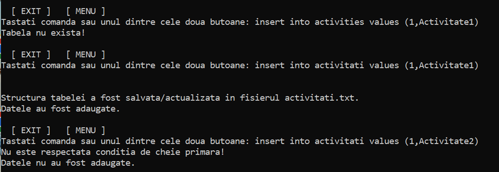
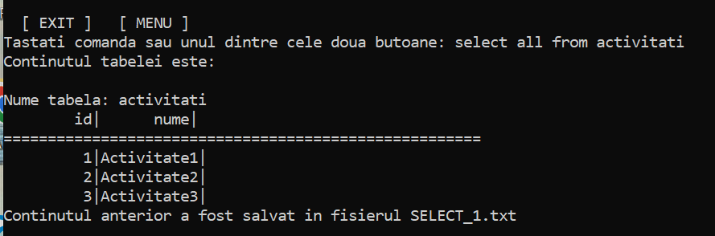
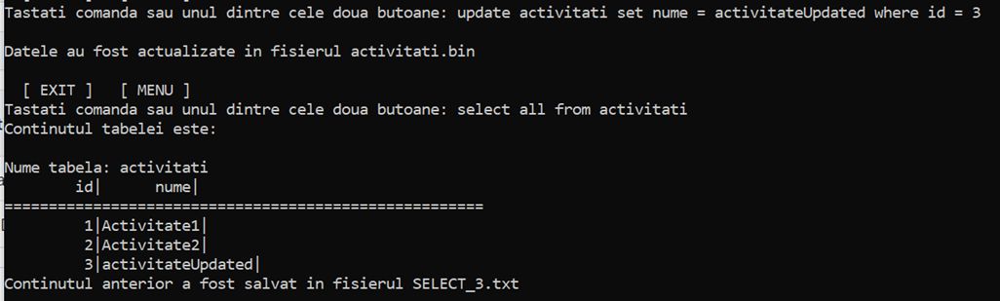
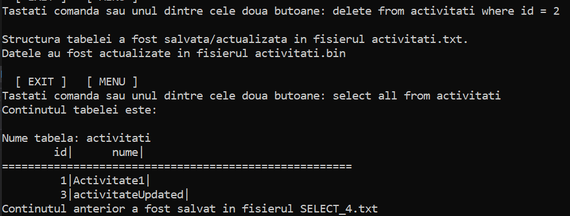
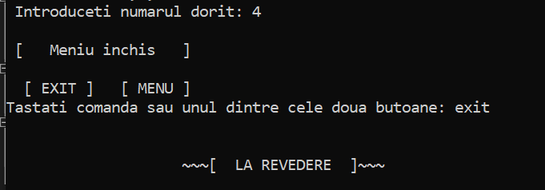

# Proiect-programare-orientata-obiect-in-C---baza-de-date-
In cadrul disciplinei POO in limbajul C++ am realizat, in echipa formata de doua persoane, cel mai complex proiect (de pana acum), ce consta intr-o baza de date asemanatoare MySQL sau SQLite, respectand anumite cerinte obligatorii. Proiectul a obtinut punctaj maxim.

Aplicatia este una de tip consola, realizata in Visual Studio 2019. Primeste input de la tastatura, din fisiere text, binare sau csv, 
putand fi lansata din IDE-ul Visual Studio sau din linia de comanda. Functia main poate primi argumente in linia de comanda: maxim
5 fisiere text sau sintagma "import into nume_tabela fisier.csv", ce populeaza o tabela cu date din respectivul fisier.
Se pot crea si sterge tabele (CREATE/DROP TABLE) , se pot popula rand cu rand (INSERT INTO..) sau mai multe randuri deodata (cu fisier .csv),
se pot realiza select-uri, update-uri, delete-uri, simuland limbajul SQL.

Parsarea comenzilor este realizata cu ajutorul regex. Aplicatia poate fi rulata direct cu ajutorul fisierului .exe, permitand si argumente in linia de comanda. Aceste argumente pot fi fisiere txt ce contin comenzi, cate una pe fiecare rand, sau se pot importa date intr-o tabela anterior creata din fisiere csv. Pentru a adauga argumente, se poate lansa executabilul din powershell.

Prima pagina:

Sintaxa comenzilor, vizualizata prin una din comenzile din meniu:

Crearea unei tabele:

Adaugare date:

Vizualizare date:

Actualizare date:

Stergere date:

Exit:

